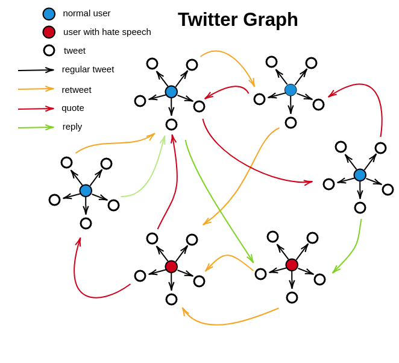

# DGNN on Twitter Hate-Speech Data

[Original Paper](https://arxiv.org/abs/1803.08977), [Data](https://www.kaggle.com/manoelribeiro/hateful-users-on-twitter#users_clean.graphml), [Repo](https://github.com/manoelhortaribeiro/GraphSageHatefulUsers), [Blog Post](https://medium.com/stellargraph/can-graph-machine-learning-identify-hate-speech-in-online-social-networks-58e3b80c9f7e), [Tweets Data](https://www.dropbox.com/sh/ayt6wcjzczhhtwp/AADS7aDFIiIbh-HtCaxdwsHqa?dl=0)

# TO-DO List

## Nov 13

- [ ] Figure out the design of the dataset and understand the content

  - We have two zip files. One of them contains the data that is publicized on Kaggle. This doesn't have tweets. It has userIDs and edges with timestamps 

  - Non-public data has tweets. IDs are different. The author gave the following warning:

    > **tweets.csv**: The tweets :)! The columns of this file are described on description_tweets.txt
    >
    > **users_neighborhood.csv**: this file has two rows related to the IDs: `user_id` is the id used in the graph which is on Kaggle and `user_id_original` links with the tweets!

- [ ] Investigate the statistics of the data. Lei mentioned GNNs might not work if within-the-same-class edges are not more then out-of-the-same-class edges. So check if hateful users are connected more with other hateful users. Stuff about the smoothing.
- [ ] Set bag-of-words baselines
- [ ] Review the methods that are applied on this dataset. Check the papers that cites the [original paper](https://arxiv.org/abs/1803.08977). 

### Understanding Dataset

- [ ] Check if RT's have text
- [ ] How they labeled hateful users. Did they classify using the author's tweets, or were retweets considered as well.