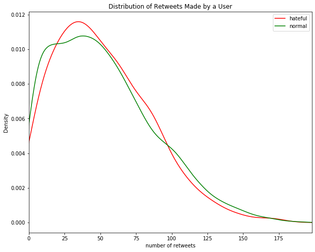
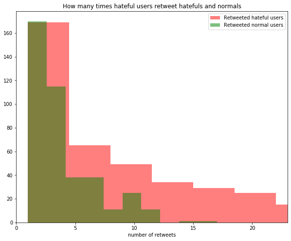
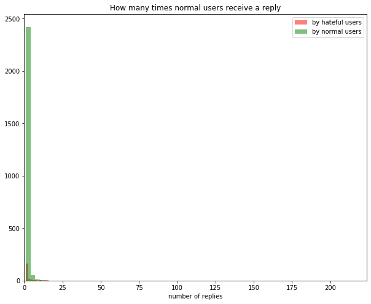

# DGNN on Twitter Hate-Speech Data

[Original Paper](https://arxiv.org/abs/1803.08977), [Data](https://www.kaggle.com/manoelribeiro/hateful-users-on-twitter#users_clean.graphml), [Repo](https://github.com/manoelhortaribeiro/GraphSageHatefulUsers), [Blog Post](https://medium.com/stellargraph/can-graph-machine-learning-identify-hate-speech-in-online-social-networks-58e3b80c9f7e), [Tweets Data](https://www.dropbox.com/sh/ayt6wcjzczhhtwp/AADS7aDFIiIbh-HtCaxdwsHqa?dl=0)

## Data Analysis

- How much they retweet?

  

  

  

- How many times they got retweeted?

  ​		

  

  

  

----------

- How much they reply?

  

  

  

- How many times they receive a reply?

  ​		

  

  

  

Additional remarks from paper about node features:

> hateful users tweet more frequently, follow more people each day and their accounts are more short-lived and recent

### Remarks on the Dataset

Data Collection

> We represent the connections among users in Twitter using the retweet network (Cha et al. 2010). Sampling the retweet network is hard as we can only observe out-coming edges (due to API limitations), and as it is known that any unbiased in-degree estimation is impossible without sampling most of these “hidden” edges in the graph (Ribeiro et al. 2012). Acknowledging this limitation, we employ Ribeiro et al. Direct Unbiased Random Walk algorithm, which estimates out-degrees distribution efficiently by performing random jumps in an undirected graph it constructs online (Ribeiro, Wang, and Towsley 2010). Fortunately, in the retweet graph the outcoming edges of each user represent the other users she - usually (Guerra et al. 2017) - endorses. With this strategy, we collect a sample of Twitter retweet graph with 100,386 users and 2,286,592 retweet edges along with the 200 most recent tweets for each users, as shown in Figure 1. This graph is unbiased w.r.t. the out degree distribution of nodes.

How they selected which nodes to label:

> As the sampled graph is too large to be annotated entirely, we need to select a subsample to be annotated. If we choose tweets uniformly at random, we risk having a very insignificant percentage of hate speech in the subsample. On the other hand, if we choose only tweets that use obvious hate speech features, such as offensive racial slurs, we will stumble in the same problems pointed in previous work. We propose a method between these two extremes. We:
>
> - Create a lexicon of words that are mostly used in the context of hate speech. This is unlike other work (Davidson et al. 2017) as we do not consider words that are employed in a hateful context but often used in other contexts in a harmless way (e.g. '*n\*gger*'); We use 23 words such as '*holohoax*', '*racial treason*' and '*white genocide*', handpicked from [Hatebase.org](hatebase.org) (Hate Base 2017), and ADL’s hate symbol database (ADL 2017). 
>
> - Run a diffusion process on the graph based on DeGroot’s Learning Model (Golub and Jackson 2010), assigning an initial belief $p_i^0=1$ to each user $u_i$ who employed the words in the lexicon; This prevents our sample from being excessively small or biased towards some vocabulary. 
>
>   
>
> - Divide the users in 4 strata according to their associated beliefs after the diffusion process, and perform a stratified sampling, obtaining up to 1500 user per strata.

How did annotaters label:

> Annotators were asked to consider the entire profile (limiting the tweets to the ones collected) rather than individual publications or isolate words and were given examples of terms and codewords in ADL’s hate symbol database. Each user profile was independently annotated by 3 annotators, and, if there was disagreement, up to 5 annotators.

# TO-DO List

## Week of Nov 11

- [x] Figure out the design of the dataset and understand the content

  - We have two zip files. One of them contains the data that is publicized on Kaggle. This doesn't have tweets. It has userIDs and edges with timestamps 

  - Non-public data has tweets. IDs are different. The author gave the following warning:

    > **tweets.csv**: The tweets :)! The columns of this file are described on description_tweets.txt
    >
    > **users_neighborhood.csv**: this file has two rows related to the IDs: `user_id` is the id used in the graph which is on Kaggle and `user_id_original` links with the tweets!

- [x] Investigate the statistics of the data. Lei mentioned GNNs might not work if within-the-same-class edges are not more then out-of-the-same-class edges. So check if hateful users are connected more with other hateful users. Stuff about the smoothing.
- [x] Set bag-of-words baselines
- [ ] Review the methods that are applied on this dataset. Check the papers that cites the [original paper](https://arxiv.org/abs/1803.08977). 

### Understanding Dataset

- [x] Check if RT's have text

  - Yes

- [x] How they labeled hateful users. Did they classify using the author's tweets, or were retweets considered as well.

  - I have added for this above 

- [x] Are there replies without tweet IDs, directly to the user? (like mentions)

  - Yes. 275K out of 4M
  
- [x] date distribution

  | quantile   | date   |
  | ---- | ---- |
  | 0.00 |  2006-12-17 |
  | 0.05 |  2017-03-04 |
  | 0.10 |  2017-06-24 |
  | 0.15 |  2017-08-11 |
  | 0.20 |  2017-09-05 |
  | 0.25 |  2017-09-20 |
  | 0.30 |  2017-09-29 |
  | 0.35 |  2017-10-06 |
  | 0.40 |  2017-10-11 |
  | 0.45 |  2017-10-15 |
  | 0.50 |  2017-10-18 |
  | 0.55 |  2017-10-20 |
  | 0.60 |  2017-10-23 |
  | 0.65 |  2017-10-24 |
  | 0.70 |  2017-10-25 |
  | 0.75 |  2017-10-26 |
  | 0.80 |  2017-10-27 |
  | 0.85 |  2017-10-28 |
  | 0.90 |  2017-10-29 |
  | 0.95 |  2017-10-30 |
  | 1.00 |  2017-11-01 |
  
